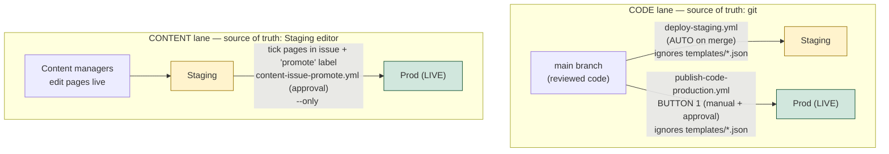
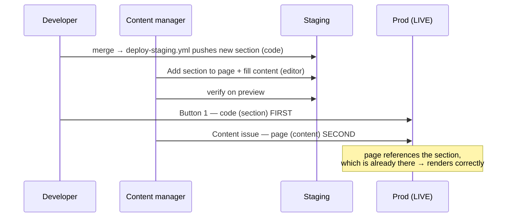

# Theme CI/CD: Staging → Production

This document explains how code and content move from development to the live
storefront, why the pipeline is split into two independent "lanes", and the
rules each team member must follow to keep it working.

**Read the mental model first — everything else follows from it.**

---

## 1. The one idea everything hangs on: *source of truth*

For every file in the theme, ask: **"If I want the correct, current version, where do I look?"** The answer is different for two kinds of files, and that difference is the whole design.

| Kind | What it is | Who authors it | **Source of truth** |
|---|---|---|---|
| **CODE** | `*.liquid`, `sections/`, `blocks/`, `snippets/`, `assets/`, `layout/`, `locales/`, `config/settings_schema.json`, **`config/settings_data.json`** | Developers | **git** |
| **CONTENT** | Page templates: `templates/*.json`, `templates/customers/*.json` | Content managers | **Staging theme** (the Shopify editor) |

Two different authors, two different homes. **Git and Shopify never sync automatically** — files only move when a workflow runs `shopify theme push` (git → Shopify) or `shopify theme pull` (Shopify → git).

> When a content manager edits a page in the Shopify editor, the change is written to `templates/<page>.json` **on Shopify's servers only**. Your git repo is not touched. That is why content is promoted *from Staging*, not from git — git doesn't have the manager's latest edits.

---

## 2. The two lanes

Production receives updates through **two independent, manually-triggered paths** — a **workflow button** for code and a **tick-box issue** for content — each sourced from its own source of truth. Neither ever copies "the whole theme", so **nothing half-finished can ride along by accident.**



- **CODE lane** always ignores `templates/*.json`, so it can never disturb the pages content managers own. It *does* carry `settings_data.json`, re-asserting git's global settings every deploy.
- **CONTENT lane** carries *only* the page(s) you explicitly name. Pages you don't name — including your colleagues' in-progress work — stay on Staging.

**This is what removes the "wait for everyone" problem.** With three managers editing three different pages, you promote only the one that's approved; the other two are simply not named.

---

## 3. What you need (prerequisites)

### Themes (on `iyeamb-p0.myshopify.com`)

| Theme | Role | ID |
|---|---|---|
| **Skin Stylus Staging** | `[unpublished]` — review here | `154568622272` |
| **Skin Stylus Prod** | `[live]` — customers see this | `154633666752` |

These IDs are pinned in workflows via secrets. **Never rename or delete either theme; never `shopify theme publish` the Staging theme** (it would flip which theme is live and break the pipeline).

### GitHub secrets (Repo → Settings → Secrets and variables → Actions)

| Secret | Purpose |
|---|---|
| `SHOPIFY_CLI_THEME_TOKEN` | Theme Access app password (auth for CLI) |
| `SHOPIFY_STORE` | `iyeamb-p0.myshopify.com` |
| `SHOPIFY_STAGING_THEME_ID` | `154568622272` |
| `SHOPIFY_PROD_THEME_ID` | `154633666752` |

### GitHub environment

- **`production-approval`** — a GitHub *Environment* with required reviewers. Both prod buttons are gated behind it, so a promotion to the live store always needs a human approval.

### Access

- **Developers:** write access to the repo; ability to run workflows.
- **Content managers:** Shopify staff access with the **Themes** permission, so they can edit in the Staging theme editor. (Note: Shopify permissions are coarse — they cannot be scoped to a single page; see the rules in §6.)
- **Local dev (optional):** [Shopify CLI](https://shopify.dev/docs/themes/tools/cli) installed — `npm install -g @shopify/cli @shopify/theme`.

---

## 4. The workflows

| Workflow | Trigger | Lane | What it does |
|---|---|---|---|
| `deploy-staging.yml` | **Auto** — every push to `main` | Code | Pushes code from git → Staging, ignoring `templates/*.json`. |
| `publish-code-production.yml` | **Manual** (Button 1) + approval | Code | Pushes code from git → **Prod** (`--allow-live`), ignoring `templates/*.json`. Fails loudly if the push reports errors. |
| `content-issue-refresh.yml` | **Auto** — on `templates/*.json` change (+ manual) | Content | Keeps the **"Content promotion" issue** checklist in sync with the templates in git. Uses `GITHUB_TOKEN` (editing an issue needs no PAT). |
| `content-issue-promote.yml` | **On `promote` label** added to that issue + approval | Content | Reads the **ticked** page(s), pulls them from Staging, snapshots, pushes **only** those → **Prod** (`--allow-live`), then comments the result and unchecks the boxes. Fails loudly if the push reports errors. |
| `theme-prune.yml` | **Manual** (dry-run / delete, per target) + approval | Ops | Deletes files listed in `.github/theme-prune-manifest.txt` from a theme, to reconcile the live themes with a git cleanup (see §9). |

All are in `.github/workflows/`. Removed over time: `publish-production.yml` (whole-theme copy — caused the "wait for a 100%-clean staging" problem) and `publish-content-production.yml` (the dropdown promoter — superseded by the self-maintaining issue flow above).

---

## 5. Worked examples

### Example A — Developer ships a code change

1. Branch, edit a section (e.g. `sections/main-product.liquid`), open a PR.
2. Merge to `main`. → `deploy-staging.yml` runs automatically → code is on **Staging**.
3. Review on Staging: `https://iyeamb-p0.myshopify.com?preview_theme_id=154568622272`
4. When happy, go to **Actions → Publish Code to Production → Run workflow**, approve when prompted. → code is live on **Prod**.

Page content on Prod is untouched throughout (the code lane ignores `templates/*.json`).

### Example B — Content manager updates one page while others are mid-edit

Scenario: Manager A finished the **About** page. Managers B and C are still working on **Contact** and **Home**.

1. Manager A edits **About** in the Staging theme editor. The change lands in `templates/page.about-us.json` on Staging.
2. Manager A verifies About on the Staging preview link.
3. Open the **"Content promotion" issue** (auto-maintained; it has a checkbox per template). **Tick** `templates/page.about-us.json` (tick more than one to promote several at once), then add the **`promote`** label.
4. `content-issue-promote.yml` runs → **approve** when prompted → **only** the ticked page(s) are promoted to Prod. Contact and Home (B and C's unfinished work) stay on Staging, never touched. The workflow then comments the result and unchecks the boxes.

> The workflow refuses anything that isn't a `templates/*.json` path, so you cannot accidentally promote code or `settings_data.json` this way. If you add the label with nothing ticked, it comments "nothing checked" and removes the label — no wasted approval.

### Example C — Changing a global setting (colors, fonts, logo)

Global settings live in `config/settings_data.json`, which is **git-owned**. Content managers do **not** change these in the editor.

1. A developer edits `config/settings_data.json` in a PR (or edits on Staging, then pulls it into git — see §7) and merges.
2. `deploy-staging.yml` pushes it to Staging; verify.
3. Run **Button 1 (Publish Code to Production)** to take it live.

Global settings are the one file that can't be patched per-page (it's a single global blob), which is exactly why it lives behind version control and the code lane.

### Example D — New section (code) that the content team then uses (content)

This is the cross-lane case: a developer builds a new section, and afterwards a content manager places it on a page and fills in the copy. It touches **both** lanes, so it takes **both** buttons — **and the order on prod matters.**

**Phase 1 — Developer builds the section (CODE lane)**

1. Developer creates `sections/testimonial-carousel.liquid` (with its ``), PRs, and merges to `main`.
2. `deploy-staging.yml` runs automatically → the section is now on **Staging** and appears in the theme editor's **"Add section"** picker. No page uses it yet; no content has changed.

**Phase 2 — Content manager uses it (CONTENT lane)**

3. In the Staging editor, the content manager opens a page (e.g. About), clicks **Add section → Testimonial Carousel**, and fills in the copy/images. This writes to `templates/page.about-us.json` **on Staging**.
4. They verify the page on the Staging preview link.

**Phase 3 — Promote to prod, code FIRST, then content**

5. Run **Button 1 — Publish Code to Production** so the new section's code exists on Prod.
6. *Then* promote the page via the **Content promotion issue** — tick `templates/page.about-us.json`, add the `promote` label, approve.



> **Why the order?** On Staging the ordering is automatic — the section is deployed on merge, long before anyone can use it. But on **Prod**, if you promote the page (content) *before* the section (code), Prod would have a page pointing at a section that doesn't exist yet → broken render. **Always code first (Button 1), then content (promote the page)** for any change that adds/renames a section the new content depends on. (Deleting a section is the mirror image: promote the content that stops using it first, then remove the code.)

---

## 6. Do's and Don'ts

### For Content Managers

**Do**
- ✅ Make content edits (copy, images, section arrangement) **only in the Skin Stylus Staging editor**.
- ✅ Work on **your assigned page(s)** — one person per page at a time.
- ✅ **Verify your page on the Staging preview** before signalling it's ready to promote.
- ✅ Promote by **ticking your page in the "Content promotion" issue and adding the `promote` label** — don't hand-edit theme files.
- ✅ For a **brand-new page**, create it as a **JSON template in the editor** (Online Store → Themes → Edit code → *Add a new template* → page → JSON), *not* as a `.liquid` file. Only JSON templates support "Add section" in the editor.

**Don't**
- ❌ Don't touch **Theme settings (the gear)** — colors, fonts, logo. Those are git-owned; any editor change there is not version-controlled and will be **overwritten on the next code deploy**.
- ❌ Don't edit content **directly on Prod** — it's not the source of truth, has no git record, and can be overwritten.
- ❌ Don't add **Custom Liquid / custom CSS** in the editor — that's code and belongs in git.
- ❌ Don't edit the **same page** someone else is editing at the same time — last save wins, silently.
- ❌ Don't create brand-new pages/templates without a developer in the loop (a new template only exists on Staging until someone promotes/backs it up).

### For Developers

**Do**
- ✅ Make all code changes (`.liquid`, `sections/`, `blocks/`, `snippets/`, `assets/`, `layout/`, `locales/`, `config/settings_*.json`) via **PR → `main`**.
- ✅ Let `deploy-staging.yml` sync code to Staging; **verify on the preview link** before Button 1.
- ✅ Own `config/settings_data.json` deliberately — treat global-setting changes as reviewed code changes.
- ✅ Use **Button 1** for code, the **Content promotion issue** for content — keep the lanes separate.
- ✅ For a change spanning both lanes (a new section the content will use), promote **code first (Button 1), then content (the issue)** — see Example D. When *removing* a section, reverse it: content first, then code.
- ✅ Keep git's `settings_data.json` authoritative (pull from Prod first — see §7).

**Don't**
- ❌ Don't push `templates/*.json` from git to Staging/Prod — the workflows ignore them on purpose so editor work isn't clobbered.
- ❌ Don't `shopify theme publish` the Staging theme — it flips live status and breaks the pipeline. Publishing here means *pushing content into the fixed Prod theme ID*, never swapping roles.
- ❌ Don't assume merging a PR touches Prod — only Button 1 and the content-promotion issue do.
- ❌ Don't promote content **from git** — content's source of truth is Staging; the promote workflow pulls it from there.
- ❌ Don't rename/delete either theme — the IDs are pinned in secrets.

---

## 7. One-time migration (do this before relying on the new model)

Because `settings_data.json` flipped from editor-managed to git-owned, git's copy must be made authoritative first — otherwise the first code deploy could overwrite live global settings with a stale snapshot.

```bash
# Pull the CURRENT live global settings from Prod into git, so git is the truth.
shopify theme pull --store=iyeamb-p0.myshopify.com \
  --theme=154633666752 \
  --only config/settings_data.json
# review the diff, then commit to main
```

After this commit, the code lane will correctly carry the real global settings forward.

---

## 8. Known limitations & parked items

- **Rollback history:** the `content-snapshots` branch is force-pushed on each content promotion, so only the **latest** patch is retained. Richer per-page rollback history is a future enhancement.
- **Drift detection:** because Shopify can't lock the Theme-settings gear, a "scheduled `theme pull` + diff alert" would catch out-of-band edits to `settings_data.json` / structural files. Parked for later. (Note: the code lane already auto-reverts gear edits to `settings_data.json` on the next deploy.)
- **Jira-triggered promotion:** promotion is triggered today by ticking the issue + adding the `promote` label. Once Jira tracks content requests, a Jira automation can tick/label via the GitHub API — the promote logic doesn't change.
- **Continuous content backup:** git only holds a content snapshot from the last `pull`/promotion. A scheduled full `theme pull` would keep the repo a current, diffable backup of Staging content. Parked.

---

## 9. Reconciling the live themes with git (theme-prune)

The deploy pipeline runs `--nodelete` **and** the code lane ignores `templates/*.json`. That protects content — but it also means **deletions in git never propagate to the themes.** If you remove templates/sections/snippets from git and want them gone from the live themes too, the themes need a deliberate prune.

`theme-prune.yml` does this: it deletes the files listed in `.github/theme-prune-manifest.txt` from a theme using the Shopify CLI (a scoped push), and **fails loudly** if the push reports errors.

**Always run it in this order:**
1. `mode=dry-run`, `target=staging` — lists what would be deleted and confirms CLI/theme access. Deletes nothing.
2. `mode=delete`, `target=staging` — delete on the draft theme; verify.
3. `mode=delete`, `target=prod` — only after Staging is clean.

> Note the `.liquid`-vs-`.json` gotcha: a theme can't hold both `page.x.liquid` and `page.x.json` (same template name). If a page won't take sections in the editor or a content push is rejected with *"already exists with liquid extension"*, a stale `.liquid` is on the theme — prune it (or delete it in Edit code).
```
