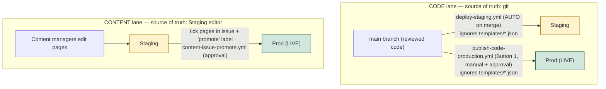

# Theme CI/CD & Content Operations — Full Guide

How code and content move from development to the live SkinStylus storefront,
what every scenario looks like, and exactly what developers and content
managers should do (and why).

**If you read nothing else, read §1 (mental model) and §7 (scenarios).**

## Contents
1. [The mental model (read first)](#1-the-mental-model-read-first)
2. [Pages vs Templates vs Sections](#2-pages-vs-templates-vs-sections)
3. [Environments & prerequisites](#3-environments--prerequisites)
4. [The workflows](#4-the-workflows)
5. [The content promotion issue](#5-the-content-promotion-issue)
6. [Roles — what to do and why](#6-roles--what-to-do-and-why)
7. [Every scenario](#7-every-scenario)
8. [Ordering rules](#8-ordering-rules)
9. [Troubleshooting & gotchas](#9-troubleshooting--gotchas)
10. [Reference](#10-reference)
11. [Bootstrapping a new brand/theme](#11-bootstrapping-a-new-brandtheme)

---

## 1. The mental model (read first)

Everything follows from one idea: **for every file, who owns the correct current version — and where does it live?**

There are **two lanes**, each with its own source of truth:

| Lane | What | Owner | Source of truth |
|---|---|---|---|
| **CODE** | `*.liquid`, `sections/`, `blocks/`, `snippets/`, `assets/`, `layout/`, `locales/`, `config/settings_schema.json`, `config/settings_data.json` | Developers | **git** |
| **CONTENT** | Page templates: `templates/*.json` | Content managers | **Staging theme** (the Shopify editor) |

Two rules that fall out of this:

- **git and Shopify never sync automatically.** Files move only when a workflow runs `shopify theme push` (git → Shopify) or `shopify theme pull` (Shopify → git).
- **Neither lane ever copies "the whole theme."** Code pushes ignore `templates/*.json`; content promotes only the pages you pick. So an unfinished page can never ride to Prod by accident — this is what removed the old "wait until Staging is 100% clean" problem.



---

## 2. Pages vs Templates vs Sections

Mixing these three up causes almost every confusion. They live in different places.

| Thing | What it is | Where it lives | Scope |
|---|---|---|---|
| **Page** (resource) | A content record: title, handle/URL, body, SEO | **Store DB** (Online Store → Pages) | **Store-wide** — one copy, shared by all themes |
| **Template** | A layout file: which sections, in what order | **Theme** (`templates/page.<suffix>.json`) | **Per-theme** — Staging & Prod each have their own copy |
| **Section** | A reusable UI block (hero, FAQ, …) | **Theme** (`sections/*.liquid`) — code | Per-theme (code lane) |

**How they connect:** a *page* picks a *template* (the "Theme template" dropdown), and a template is built from *sections*. Many pages can share one template (e.g. lots of pages use the default `page.json`).

```
Page "Micro Systems"  ──uses──▶  templates/page.microsystems.json  ──built from──▶  sections/*.liquid
Page "Terms"          ──uses──▶  templates/page.json (default)
```

### Where page content actually lives — the crucial split
A page's content has **two possible homes**, and only one flows through the content pipeline:

1. **Page body** (the rich-text field on the page record) → **store-level, shared by all themes → already live everywhere the moment you save. No promotion needed.**
2. **Section content** (text/images/settings inside a JSON template's sections) → **theme-level, per-theme → must be promoted Staging → Prod.**

> So a simple text page that only uses the body field (e.g. Terms & Conditions on the default template) needs **no promotion** — its content is store-wide already. A page built from **sections** (Micro Systems) needs its template promoted.

### Rendering: how a page appears
A page is rendered on the fly by combining **the page record (store)** with **the template file from the theme you're viewing**:
- Live URL `…/pages/x` → uses the **Prod theme's** template.
- Preview `…?preview_theme_id=<staging>` → uses the **Staging theme's** template.

That's why a template must exist **on each theme** where the page should render, and why the "Theme template" dropdown only lists templates from the **published (Prod)** theme.

---

## 3. Environments & prerequisites

### Themes (store `iyeamb-p0.myshopify.com`)
| Theme | Role | ID |
|---|---|---|
| **Skin Stylus Staging** | `[unpublished]` — review here | `154568622272` |
| **Skin Stylus Prod** | `[live]` — customers see this | `154633666752` |

Roles never swap. **Never `shopify theme publish` the Staging theme** (it would flip which theme is live and break every workflow), and never rename/delete either (IDs are pinned in secrets).

### GitHub secrets (Settings → Secrets and variables → Actions)
| Secret | Value / purpose |
|---|---|
| `SHOPIFY_CLI_THEME_TOKEN` | Theme Access token (CLI auth) |
| `SHOPIFY_STORE` | `iyeamb-p0.myshopify.com` |
| `SHOPIFY_STAGING_THEME_ID` | `154568622272` |
| `SHOPIFY_PROD_THEME_ID` | `154633666752` |

### GitHub environment
- **`production-approval`** — required-reviewers gate. Every workflow that writes to **Prod** waits here for a human approval.

### Access
- **Developers:** repo write access; ability to run/approve workflows.
- **Content managers:** Shopify staff access with the **Themes** permission (to edit the Staging theme) and GitHub access to tick the promotion issue. (Shopify permissions are coarse — they can't be scoped to one page; discipline is in §6.)

---

## 4. The workflows

All in `.github/workflows/`.

| Workflow | Trigger | Lane | What it does |
|---|---|---|---|
| **`deploy-staging.yml`** | Auto — push to `main` | Code | Push code git → Staging, ignoring `templates/*.json`. Also carries git's `settings_data.json`. |
| **`publish-code-production.yml`** | Manual (**Button 1**) + approval | Code | Push code git → **Prod** (`--allow-live`), ignoring `templates/*.json`. Fail-loud. |
| **`content-issue-refresh.yml`** | Auto on `templates/**.json` change · manual · **`refresh` label** | Content | Rebuild the "Content promotion" issue checklist from the **Staging** theme's page templates. Auto-removes the `refresh` label. Uses `GITHUB_TOKEN` (no PAT). |
| **`content-issue-promote.yml`** | **`promote` label** on the issue + approval | Content | Promote the **ticked** page(s): pull from Staging → snapshot → push only those to **Prod**. Plan/result tables, fail-loud, comments + unchecks on success, keeps label + comments on failure. Concurrency-guarded. |
| **`theme-seed-pages.yml`** | Manual + approval | Ops | Bootstrap new/empty page templates onto a theme: remove the stale `page.<x>.liquid` twin, then upload git's `page.<x>.json`. Staging-first. |

> Retired: `publish-production.yml` (whole-theme copy) and `publish-content-production.yml` (dropdown promoter) — both superseded. `theme-prune.yml` (one-off theme/git reconciliation) was removed after use; recover from git history if a future cleanup needs it.

---

## 5. The content promotion issue

The content lane is driven by a single self-maintaining GitHub issue titled **"Content promotion"** (label `content-promotion`).

- It lists **page templates that exist on the Staging theme**, as human-friendly names (`Micro Systems`, not `templates/page.microsystems.json` — though the path stays inline so the promoter can parse it), alphabetical.
- **It maintains itself.** On any template change it rebuilds. To force a rebuild (e.g. after creating a page in the editor), add the **`refresh`** label — it rebuilds from Staging and removes the label.
- **To promote:** tick the page(s) → add the **`promote`** label → approve. Only ticked pages are pushed to Prod; it comments a result table and unchecks the boxes. Nothing ticked → it says so and removes the label (no wasted approval).

Why an issue and not a dropdown? A dropdown's options live in a workflow file, and GitHub forbids the Actions token from editing workflow files (would need a stored PAT). An **issue** can be edited by the normal token — so the list stays current with **no PAT and no manual regeneration**.

---

## 6. Roles — what to do and why

### Content managers

**Do**
- ✅ Edit content **only in the Skin Stylus Staging editor** — Staging is the source of truth for content.
- ✅ **Verify your page on the Staging preview** before promoting.
- ✅ Promote by **ticking your page in the "Content promotion" issue + `promote` label** — never hand-edit theme files.
- ✅ Created a **new page**? Make it a **JSON template in the editor** (Edit code → *Add a new template* → page → **JSON**), then add the `refresh` label so it appears in the list. (`.liquid` templates can't take sections.)
- ✅ One person per page at a time.

**Don't**
- ❌ Don't touch **Theme settings (the gear)** — colors/fonts/logo are git-owned and get overwritten on the next code deploy.
- ❌ Don't edit content **directly on Prod** — not the source of truth, no record, will be overwritten.
- ❌ Don't add **Custom Liquid / custom CSS** in the editor — that's code, belongs in git.
- ❌ Don't edit the **same page** someone else is editing — last save wins silently.

*Why:* content lives on Staging and is promoted deliberately; anything that isn't page content (global settings, code) belongs to developers/git so it stays reviewed and version-controlled.

### Developers

**Do**
- ✅ All code changes via **PR → `main`** (`.liquid`, sections, blocks, snippets, assets, layout, locales, `config/settings_*.json`).
- ✅ Let `deploy-staging.yml` sync to Staging; **verify on the preview** before **Button 1**.
- ✅ Treat `config/settings_data.json` as reviewed code (it's git-owned; every deploy re-asserts it).
- ✅ For a change spanning both lanes (a new section content will use), **code first (Button 1), then content** (§8).
- ✅ New pages that need a code scaffold on a theme: use **`theme-seed-pages`** (Staging first).

**Don't**
- ❌ Don't push `templates/*.json` from git to the themes routinely — the pipeline ignores them so editor work isn't clobbered.
- ❌ Don't `shopify theme publish` the Staging theme.
- ❌ Don't assume merging a PR touches Prod — only Button 1 and the content promote do.

---

## 7. Every scenario

For each: what changed, which lane, and the exact steps.

### A. Developer ships a code change (section/CSS/JS/snippet)
Lane: **Code.**
1. PR → merge to `main` → `deploy-staging.yml` auto-deploys to Staging.
2. Verify on Staging preview.
3. **Button 1** (Publish Code to Production) → approve → live.
Page content untouched (code lane ignores `templates/*.json`).

### B. Global setting (colors, fonts, logo)
Lane: **Code** (`settings_data.json` is git-owned).
1. Edit `config/settings_data.json` in a PR → merge → auto to Staging → verify.
2. **Button 1** → approve. *Content managers must not change these in the editor* (overwritten next deploy).

### C. Existing page, existing section, new text/images
Lane: **Content** (only a `templates/*.json` changed).
1. Edit the page in the Staging editor → verify on preview.
2. Issue → tick the page → `promote` label → approve. Only that page ships.

### D. Existing page, add an *existing* section type
Lane: **Content** (the section's code is already on Prod).
Same as C — just promote the page.

### E. Existing page, add a *brand-new* section type
Lane: **Both.** Order matters (§8).
1. Dev builds `sections/<new>.liquid` → PR → merge (now on Staging).
2. Content manager adds it to the page in the editor → verify.
3. **Button 1 first** (ship the section to Prod), **then** promote the page via the issue. (Otherwise Prod has a page referencing a section that isn't there → broken.)

### F. Brand-new page
Lane: **Both / setup.**
1. **Page record:** Online Store → Pages → Add page (title, handle). Store-wide.
2. **Template:** in the Staging editor, Edit code → *Add a new template* → page → **JSON** (not `.liquid`). Add sections, fill content.
3. Add the **`refresh`** label to the issue → the new page appears in the list.
4. **Before first promote to Prod:** the Prod theme needs the template too. For a genuinely new page there's no `.liquid` legacy, so just promote (tick + `promote`); the template lands on Prod. (If a stale `page.<x>.liquid` exists on Prod, clear it first — see §9 and `theme-seed-pages`.)
5. Assign the template to the page in admin (the dropdown shows it once it's on the **published/Prod** theme).

### G. Body-only page (Terms, Privacy, simple text)
Lane: **None (store-level).**
The page uses the default template and its content is in the **body** field → store-wide → **already live on Prod the moment you save**. Nothing to promote. It won't appear as its own entry in the issue (it shares "Page (default)").

### H. Promote several pages at once
Issue → tick multiple pages → `promote` → approve. All ticked pages ship together.

### I. Refresh the page list (after creating pages in the editor)
Add the **`refresh`** label to the issue → it rebuilds from Staging and removes the label. (Also happens automatically when `templates/*.json` changes in git.)

### J. Roll back a bad page
The `content-snapshots` branch holds a pre-push snapshot of each promotion. To revert, restore that page's `templates/*.json` from the branch and re-promote. *Note: the branch is force-pushed each promotion, so only the latest snapshot is retained (see §10).*

### K. Remove an unused page/section/template
1. Remove from git (PR) — cleans the repo and the issue list.
2. The live themes still hold the file (pipeline runs `--nodelete`). To also remove it from the themes, restore/recreate `theme-prune` from git history, or delete it in Edit code.

---

## 8. Ordering rules

- **Cross-lane change (new section a page will use): code first, content second.** Ship the section (Button 1), *then* promote the page. On Staging this is automatic (section deploys on merge before anyone can use it); on **Prod** the order is manual and matters — content before code = a page pointing at a missing section = broken render.
- **Removing a section: reverse it.** Promote the content that stops using the section first, then remove the section code.

---

## 9. Troubleshooting & gotchas

**"Promotion passed but the page didn't change."**
The page's `.json` template probably isn't on **Staging** (only in git, or the old `.liquid` is there). The promote pulled nothing → no-op. Fix: ensure the JSON template exists on Staging (editor Add template, or `theme-seed-pages`), `refresh`, then promote.

**"I can't add sections to a page in the editor."**
Its template is a **`.liquid`** file — only **JSON** templates support Add section. Convert it (Edit code: delete the `.liquid`, Add a new template → page → JSON).

**"Push rejected: already exists with liquid extension."**
The theme has **both** `page.x.liquid` and `page.x.json` (same template name — not allowed). Remove the `.liquid` (Edit code, or `theme-seed-pages` which does this). This is why fresh pages should be JSON from the start.

**"A page I created in Shopify doesn't show in the issue list."**
The list is sourced from the **Staging theme**. If the page's template was created in the editor, add the **`refresh`** label. If it doesn't appear even then, the template isn't on Staging yet (create it there).

**"I deleted a template from git but it's still on the theme."**
By design — the pipeline runs `--nodelete` (protects content). Deletions don't propagate; remove from the theme deliberately (Edit code, or the archived `theme-prune`).

**"My editor change to global colors disappeared."**
`settings_data.json` is git-owned; every code deploy re-asserts git's version. Change global settings via a PR, not the editor gear.

**A promote failed.**
`content-issue-promote` is fail-loud — it comments the failure on the issue and keeps the `promote` label. Fix the cause, then remove & re-add the label to retry.

---

## 10. Reference

- **Issue:** "Content promotion" (label `content-promotion`). Labels: `promote` (trigger a promotion), `refresh` (rebuild the list).
- **Snapshot branch:** `content-snapshots` — pre-push snapshots for rollback; force-pushed (latest only).
- **Generator:** `scripts/gen-content-list.mjs` — turns Staging page templates into the friendly issue checklist (run by CI only).

### Known limitations / parked
- **Rollback history:** `content-snapshots` keeps only the latest patch (force-pushed). Richer history is a future enhancement.
- **Drift detection:** no alert if someone edits the Theme-settings gear on a theme; the code lane auto-reverts `settings_data.json` on the next deploy, but out-of-band edits between deploys aren't flagged. A scheduled `theme pull` + diff would catch it.
- **Jira-triggered promotion:** today you tick the issue + add `promote`. A Jira automation could tick/label via the GitHub API later — the promote logic wouldn't change.
- **Continuous content backup:** git only holds content from the last pull/promotion. A scheduled full `theme pull` would keep the repo a diffable backup of Staging content.

---

## 11. Bootstrapping a new brand/theme

Because the workflows reference everything through **secrets**, this whole setup is portable. A new brand repo (started from the shared base theme) already carries the workflows, `scripts/`, and this doc — so standing up a new theme is mostly wiring, done by one script.

**`scripts/bootstrap-theme-ops.sh`** does the theme-specific parts in one run:
1. Creates an **unpublished Staging theme** (pushes the base theme code) and resolves its ID.
2. Sets the 4 GitHub **secrets** (`SHOPIFY_STORE`, `SHOPIFY_STAGING_THEME_ID`, `SHOPIFY_PROD_THEME_ID`, `SHOPIFY_CLI_THEME_TOKEN`).
3. Creates the **`production-approval`** environment + a required reviewer.
4. Creates the **labels** (`content-promotion`, `promote`, `refresh`).
5. **Generalises** brand-specific bits (blanks the seed default; rewrites store/theme IDs in this doc).
6. Triggers the **refresh** to create the Content promotion issue.

```bash
export SHOPIFY_CLI_THEME_TOKEN=shptka_xxx          # you create this in Shopify; never committed
scripts/bootstrap-theme-ops.sh \
  --repo owner/new-brand \
  --store new-brand.myshopify.com \
  --prod-theme-id <live-theme-id> \
  --reviewer <github-login> \
  [--staging-name "Brand Staging"] [--dry-run]
```

**Stays manual (by design):** creating the Shopify **Theme Access token** (you export it; it's piped to the secret, never logged), choosing/publishing which theme is **Prod**, and the first code deploy. Run with **`--dry-run`** first — it prints every step and changes nothing.
