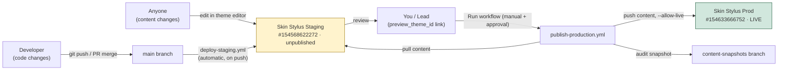
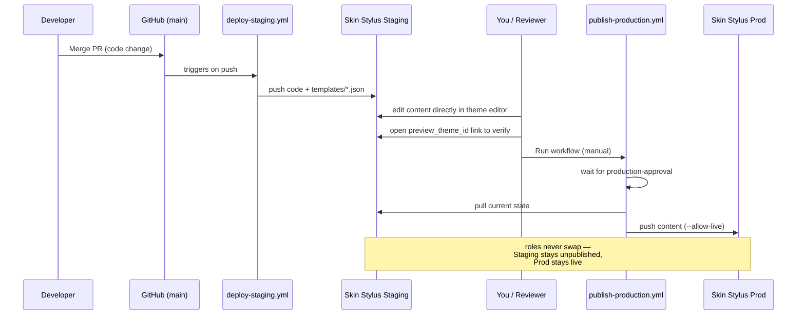

# Theme CI/CD: Staging → Production

## What we have

Two fixed-role Shopify themes on `iyeamb-p0.myshopify.com`:

| Theme | Role | ID | Purpose |
|---|---|---|---|
| **Skin Stylus Staging** | `[unpublished]` | `154568622272` | Review code + content changes before they go live |
| **Skin Stylus Prod** | `[live]` | `154633666752` | The actual storefront customers see |

Two GitHub Actions workflows drive them:

| Workflow | Trigger | What it does |
|---|---|---|
| `deploy-staging.yml` | Automatic, on every push to `main` | Pushes all theme code **and content** (`templates/*.json` included) to Skin Stylus Staging |
| `publish-production.yml` | Manual (`Run workflow` button), gated behind `production-approval` | Snapshots Staging's current state to the `content-snapshots` branch, then pushes that same content into Skin Stylus Prod |

## The flow

1. **Code changes** → PR → merge to `main` → auto-deployed to Staging.
2. **Content changes** → edit directly in the Shopify theme editor on **Skin Stylus Staging** → visible immediately on Staging preview.
3. **Review** on Staging: `https://iyeamb-p0.myshopify.com?preview_theme_id=154568622272`
4. **Promote to prod**: run `publish-production.yml` manually from the Actions tab → approve if prompted → Staging's current content is pushed into Skin Stylus Prod.

Staging and Prod never swap identities — publishing **copies content**, it does not flip which theme is live. This keeps the CI pipeline stable (see Don'ts below for why that matters).

### Architecture

### Step-by-step sequence

## What we fixed to get here

- **CI was failing** on every push to `main` because the "staging" theme was actually the store's `[live]` theme — pushing to a live theme non-interactively triggers a confirmation prompt CI can't answer. Fixed by pointing staging deploys at a real unpublished theme, and renaming both themes to match their actual roles.
- **Content changes silently never reached Staging** — the original workflow excluded `templates/*.json` from the push. Removed that exclusion so page/section content merged to `main` actually syncs.
- **Publishing used to swap live status** (`theme publish` on the staging theme itself), which would re-break the staging deploy the moment someone ran it, since the staging theme ID would become live again. Rewritten to push content into a fixed Prod theme ID instead.
- Cleaned up ~95 broken `shopify://files/videos/...` references across 13 templates that were causing local `shopify theme dev` and Staging syncs to fail entirely (unrelated pre-existing store content, not caused by code).

## Do's

- ✅ Make **content edits** (copy, images, layout) directly on the **Skin Stylus Staging** theme editor.
- ✅ Make **code changes** (`.liquid`, sections, snippets, assets, schema) via git — PR into `main`, let `deploy-staging.yml` sync them.
- ✅ Always verify on Staging (`preview_theme_id=154568622272`) before publishing.
- ✅ Run `publish-production.yml` deliberately, only when Staging is in a state you want live.
- ✅ Keep `config/settings_data.json` editor-managed — it's intentionally excluded from the code sync.

## Don'ts

- ❌ Don't call `shopify theme publish` on the Staging theme directly (via CLI or elsewhere) — it flips which theme is `[live]` and breaks the CI pipeline's assumptions.
- ❌ Don't edit content on **Skin Stylus Prod** directly — it gets overwritten by the next publish run, and your change has no git record.
- ❌ Don't rename or delete either theme — `SHOPIFY_STAGING_THEME_ID` / `SHOPIFY_PROD_THEME_ID` are pinned to specific theme IDs, not names.
- ❌ Don't assume merging a PR pushes anything to Prod — only `publish-production.yml`, run manually, does that.
- ❌ Don't edit both a template in git **and** the same content in the Staging editor around the same time — whichever syncs last wins, silently overwriting the other.
